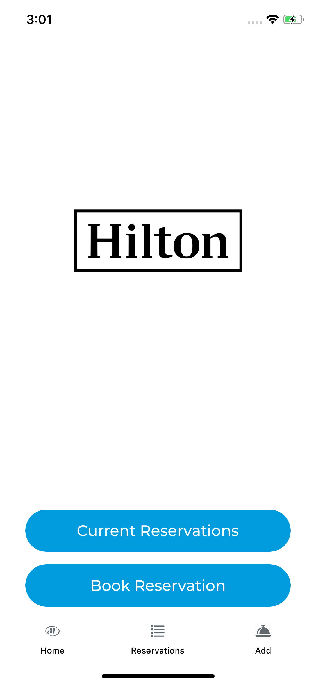
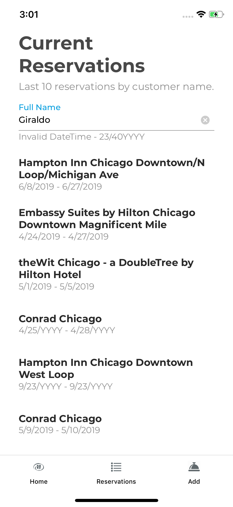
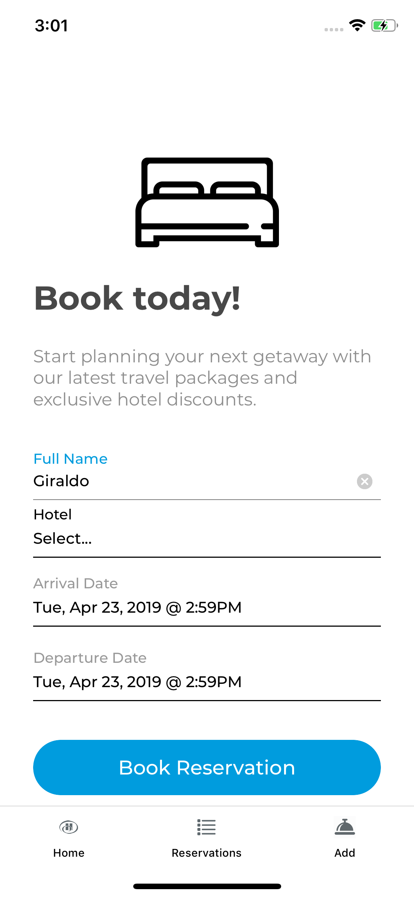

# Hilton Reservations

## Notes

- Comments have been added throughout
- Since this is only a demo, unit tests are included but not complete. There are some funcitons in the views that are not tested. Action tests have been completed.

## Development Environment

To run the app in the development environment, just call the `start` script:

```shell
npm start
```

## How it works

- **Reservation List**
  - You can lookup existing reservations by `name`. This is the full name of the customer.
  - Click `Enter` and a list of reservations will be displayed. A max of 10 reservations will be listed.
  - The name will be cached to make it easier to search for reservations.
- **Book Reservation**
  - Add a new reservation.
  - Enter a `Full Name` of a customer. This will be the name to search in the Reservation List view. *(Note: the name may be cached if one was entered in the Reservation List view. This is assumed that the same user will be going back and forth between views.)*
  - You will be redirected to the Reservation List view where you can see the new reservation in the list.

## What was used

- [react](https://facebook.github.io/react/)
- [react-native](https://facebook.github.io/react-native/)
- [@nlabs/arkhamjs](https://github.com/nitrogenlabs/arkhamjs) - For state management. (Library created by Giraldo Rosales)
- [@nlabs/react-native-form](https://github.com/nitrogenlabs/react-native-form) - A custom form component library used to manage form data. (Library created by Giraldo Rosales)
- [react-native-navigation](https://github.com/wix/react-native-navigation) - For navigation and routing.

## Screenshots


